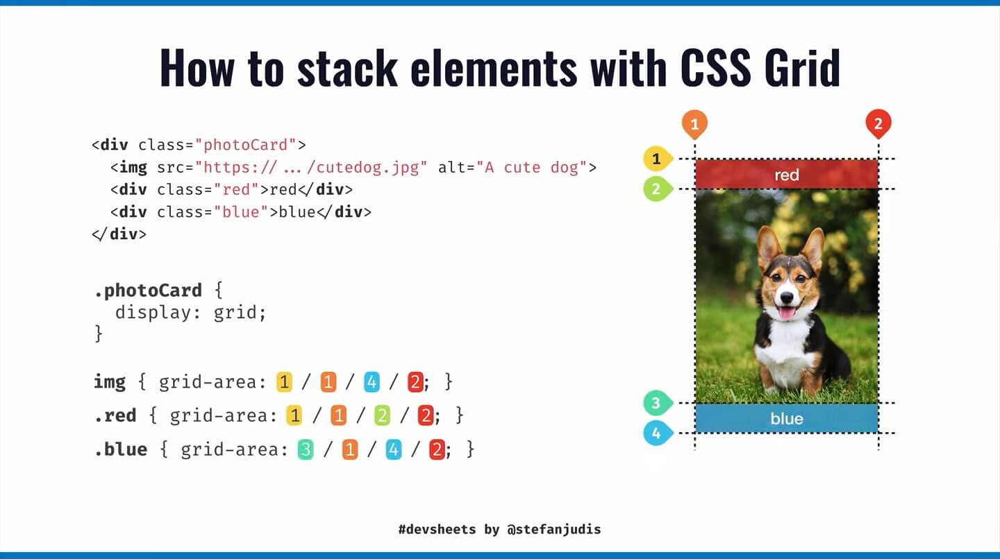

# CSS

## Grid

[How to stack elements with CSS Grid](https://www.stefanjudis.com/today-i-learned/css-grid-can-be-used-to-stack-elements/)

📚
- https://developer.mozilla.org/en-US/docs/Web/CSS/CSS_Grid_Layout/Basic_Concepts_of_Grid_Layout
- https://css-tricks.com/snippets/css/complete-guide-grid/
- https://www.freecodecamp.org/news/how-to-create-an-image-gallery-with-css-grid-e0f0fd666a5c/
