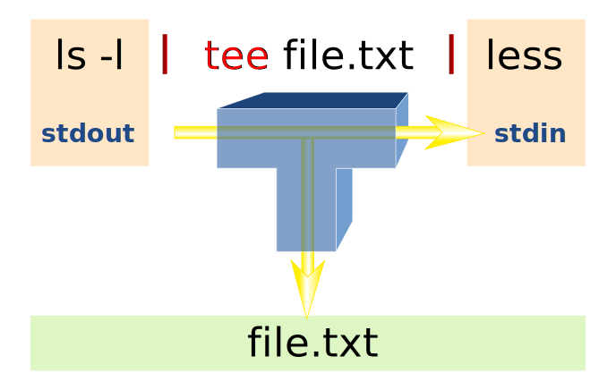
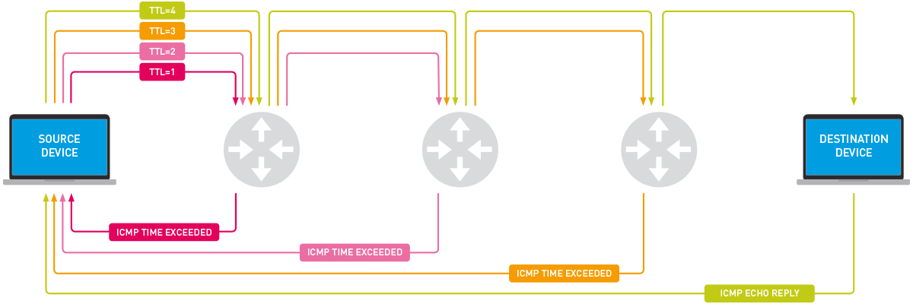

# Shell

⭐️ [Explain Shell](https://explainshell.com/)

⭐️ [ShellCheck](https://www.shellcheck.net/)

[Why is printf better than echo?](https://unix.stackexchange.com/a/65819)

Be careful about shebang (#!/usr/bin/env bash) https://unix.stackexchange.com/a/496960
> If the shebang is #!/bin/bash and you start the script as __./script the script will be executed by bash__. Absolutely no problem here.

> However, if you execute zsh ./script or __source it . ./script to the running zsh instance, it is quite common that the syntax of bash and zsh won't match.__

Use `command -v <cmd>` instead of `which` https://stackoverflow.com/a/677212

Use `basenc` to encode/decode base64-url https://man7.org/linux/man-pages/man1/basenc.1.html

📚
* https://en.wikipedia.org/wiki/List_of_Unix_commands
* https://en.wikipedia.org/wiki/List_of_GNU_Core_Utilities_commands
* [POSIX.1-2017 Online Document](https://pubs.opengroup.org/onlinepubs/9699919799/)
* https://www.gnu.org/software/bash/manual/html_node/index.html
* https://wiki.bash-hackers.org/scripting/nonportable
* [The Linux man-pages project](https://www.kernel.org/doc/man-pages/) and [Online man pages: man7.org](https://man7.org/linux/man-pages/index.html)
* [Command Line Interface Guidelines](https://clig.dev/#guidelines)

## Basic

`apropos` to search the "name" sections of all manual pages. Usually a wrapper for the `man -k`.
```sh
apropos copy
```

`type` to display the kind of a command
```sh
type tldr
# tldr is /usr/local/bin/tldr
type brew-update
# brew-update is an alias for brew update; brew outdated
type rs-shell
# rs-shell is an alias for exec /bin/zsh -l
```

Standard input (FD 0), standard output (FD 1) and standard error (FD 2). https://pubs.opengroup.org/onlinepubs/9699919799/utilities/V3_chap02.html#tag_18_07

```sh
ls existing.txt no.file >export_ls.txt
ls existing.txt no.file 1>export_ls.txt
# Redirect FD 1 to the file "export_ls.txt". Error messages are _emitted_ on FD 2.
```

```sh
ls existing.txt no.file >export_ls.txt 2>/dev/null
# Redirect FD 1 to the file "export_ls.txt" and FD 2 to the file "/dev/null/"
```

```sh
# Redirecting standard output and standard error
ls existing.txt no.file >export_ls.txt 2>&1 # POSIX
ls existing.txt no.file &>export_ls.txt # Bash
# Make FD 1 target "export_ls.txt" and FD 2 target FD 1's target
```

`read line <file.txt`
Read from 'file.txt'

```sh
# Appending file redirection
echo Hello >~/world
echo World >>~/world
# Make FD x append to the end of file.
```

tee https://en.wikipedia.org/wiki/Tee_(command)
```sh
# Copies standard input to standard output and displays the standard input result.
ls -l /var/log | tee var-log.txt | less # by default, tee will overwrite/create the file.
date | tee -a log.txt # -a is append option
date | sudo tee date.txt log.txt
```


heredoc `<<` uses to feed data to a program without storing it in an external file and must followed by any identifier. For example, mine is 'ichiwa'
```sh
cat <<ichiwa
I love you so much.
I know I am naive.
ichiwa
```

herestring `<<<` has same function as heredoc but without delimeter. Mostly use for one line command. Might not be in every shell but available in bash, ksh,
or zsh.
```sh
cat <<<'ha ha ha I know' # Equivalent to "echo 'ha ha ha I know' | cat"

cat <<<'I love you so much.
I know I am naive.'
```

Run a job in the background
```sh
<command> &

<command>
# command is running
Ctrl-Z
```

Show status of all jobs

`jobs`

Bring a specific job to foreground

`fg <job_id>`

Resume a specific job  and run it in the background

`bg <job_id>`

Dot (.) is:
* Current directory https://en.wikipedia.org/wiki/Path_(computing)#Unix_style
* Execute commands in the current environment (Equivalent to `source`) https://en.wikipedia.org/wiki/Dot_(command) && another good explanation  https://unix.stackexchange.com/a/114306
* Hidden file and directory https://en.wikipedia.org/wiki/Hidden_file_and_hidden_directory#Unix_and_Unix-like_environments

Backslash (\\) is
* Escape character, it preserves the literal value of the next character that follows.
* Backlash pairs with newline \<newline> will be removed from the input stream and effectively ignored, so it is treated as a line continuation

[Brackets](https://www.assertnotmagic.com/2018/06/20/bash-brackets-quick-reference/)
* `( cmd1; cmd2; cmd3 )` single round brackets: a command list embedded between parentheses runs as a subshell.
* `$( cmd1 )` single dollar round brackets: [command substitution](https://en.wikipedia.org/wiki/Command_substitution)
* `(( expression ))` double round brackets: [Bash's shell arithmetic](https://www.gnu.org/software/bash/manual/html_node/Shell-Arithmetic.html). This one will return exit code only.
* `$(( expression ))` double dollar round brackets: [Bash's arithmetic expansion](https://www.gnu.org/software/bash/manual/html_node/Arithmetic-Expansion.html#Arithmetic-Expansion) similar shell arithmetic but this one will return output result, instead of exit code.
* `<( cmd1 )` angle round brackets: [process substitution](https://en.wikipedia.org/wiki/Process_substitution) allows the input or output of a command to appear as a file.
* `[ expression ]` single square brackets and `[[]]` double square brackets: [Bash's conditional Expressions](https://www.gnu.org/software/bash/manual/html_node/Bash-Conditional-Expressions.html#Bash-Conditional-Expressions) is an alternate version of the built-in `test`. Yes, `[` is a Bash shell command!!!
* `{ }` single curly brackets: [Bash's brace expansion](https://en.wikipedia.org/wiki/Bash_(Unix_shell)#Brace_expansion)


## Network

`ifconfig` display the link and address status of network interfaces
```sh
ifconfig  # list all information on all network devices
ifconfig en0 up # bring en0 (Ethernet) up
ifconfig en1 down # down en1 (Wi-fi)
```

`dig (domain information groper)` check dns record
```sh
dig wikipedia.org
dig +short wikipedia.org # look up the ip
dig @1.0.0.1 # check DNS records of "wikipedia.org" by "1.0.0.1"
```

`traceroute` print the route packets take to network host
```sh
traceroute wikipedia.org
traceroute -q 10 wikipedia.org # set the number of probes to 10 probes
```



## Brace Expansion

Brace expansion generates a set of alternative combinations. Generated results need not exist as files.


```sh
echo {I,want,my,money,back}
I want my money back

echo _{I,want,my,money,back}-
_I- _want- _my- _money- _back-

echo {5..12}
5 6 7 8 9 10 11 12

echo {01..10}
01 02 03 04 05 06 07 08 09 10

echo {c..k}
c d e f g h i j k

echo {A..C}{0..13}
A0 A1 A2 A3 A4 A5 A6 A7 A8 A9 A10 A11 A12 A13 B0 B1 B2 B3 B4 B5 B6 B7 B8 B9 B10 B11 B12 B13 C0 C1 C2 C3 C4 C5 C6 C7 C8 C9 C10 C11 C12 C13


# Bash 4
echo {0001..5}
0001 0002 0003 0004 0005

echo {1..10..2}
1 3 5 7 9

echo {10..1..2}
10 8 6 4 2
```

### Example
```sh
# Bulk download
wget http://docs.example.com/documentation/slides_part{1..6}.html

mkdir /usr/local/src/bash/{old,new,dist,bugs}

# Rename file
mv myText.{txt,tex}

# Create new backup file /some/file.txt.bak
cp /some/file.txt{,.bak}

# Repeating arguments
somecommand --{force,delete}

for i in {1..100}
do
   #do something 100 times
done
```

## Filenames and Pathnames in Shell: How to do it Correctly (   https://dwheeler.com/essays/filenames-in-shell.html)

```sh
# Basic rules

## Double-quote parameter (variable) references and command substitutions
"$file"
"$(pwd)"
"$(dirname "$file")"

## Prefix all globs so they cannot expand to begin with “-”
cat ./*                   # Use this, NOT "cat *" ... Must have 1+ files.
for file in ./* ; do      # Use this, NOT "for file in *" (beware empty lists)
...
done
```

## Filename and extension extraction (https://stackoverflow.com/a/965069)

```sh
FILE="example.tar.gz"

echo "${FILE%%.*}"
example

echo "${FILE%.*}"
example.tar

echo "${FILE#*.}"
tar.gz

echo "${FILE##*.}"
gz
```

## Home (https://en.wikipedia.org/wiki/Home_directory)
| OS | Path |
| -- | ---- |
| Android	| /data/media/userid |
| BSD/Linux | /home/username     |
| macOS	   | /Users/username    |

## Shell init (https://github.com/rbenv/rbenv/wiki/unix-shell-initialization#shell-init-files)

### Zsh 
1. /etc/zshenv or /etc/zsh/zshenv (can't be overriden)
2. $ZDOTDIR/.zshenv
3. login mode:
   1. /etc/zprofile
   2. $ZDOTDIR/.zprofile
4. interactive:
   1. /etc/zshrc
   2. $ZDOTDIR/.zshrc
5. login mode:
   1. /etc/zlogin
   2. $ZDOTDIR/.zlogin

Opening a new Terminal: $ZDOTDIR/.zshenv +  $ZDOTDIR/.zprofile + $ZDOTDIR/.zshrc

Log in shell (via SSH): $ZDOTDIR/.zshenv +  $ZDOTDIR/.zprofile + $ZDOTDIR/.zshlogin

Executing a command remotely with ssh (e.g. `ssh remote_machine 'date'`): $ZDOTDIR/.zprofile +  $ZDOTDIR/.zshenv

That means __`.zprofile`__ is a candidate place to put custom setting that required in any mode.

__Note from Zshdoc (http://zsh.sourceforge.net/Intro/intro_3.html)__
> `.zprofile` is similar to `.zlogin`, except that it is sourced before `.zshrc`.

> `.zlogin` is not the place for alias definitions, options, environment variable settings, etc.
